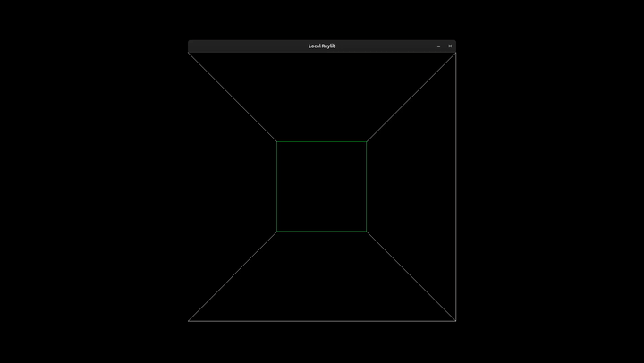

# render-boy:



A simple 3D renderer written in C using only the **2D drawing functions** provided by **raylib**. Instead of relying on raylib's built-in 3D API, this project implements its own perspective projection, camera movement, and wireframe rendering by transforming 3D points into 2D screen coordinates and drawing lines between them.

This is mostly a small learning project to better understand the mathematics behind 3D graphics—projection, transformations, rotation, and camera movement—before using a full 3D graphics pipeline. The renderer currently draws a wireframe cube and supports movement and rotation using keyboard controls.

## Project Structure

```text
.
├── hello.c
├── Makefile
└── raylib-dist/
    ├── include/
    └── lib/
```

## Makefile Targets

| Target | Description |
|---------|-------------|
| `make` | Clean and build the project |
| `make run` | Build and run the executable |
| `make clean` | Remove the executable |
| `make rebuild` | Clean and rebuild the project |

## Compiler Settings

The project is built using:

- **Compiler:** GCC
- **Include Path:** `./raylib-dist/include`
- **Library Path:** `./raylib-dist/lib`

Linked libraries:

- raylib
- math (`-lm`)
- pthread
- dl
- rt
- X11

PS: The project and its makefile has been designed and tested on linux